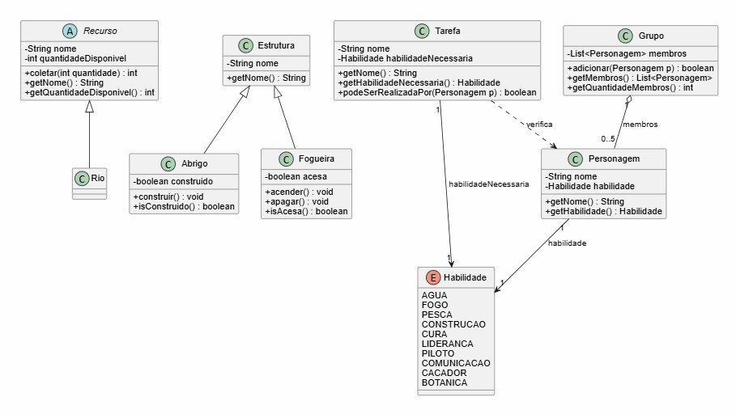

# Survivors

## Identificação

Lauren Auth Lugoch e Renata Fonseca - Sistemas de Informação

## Proposta

O projeto consiste em um jogo de sobrevivência desenvolvido em Java utilizando a biblioteca LibGDX. O jogador deve formar um grupo com cinco sobreviventes escolhidos entre dez personagens disponíveis, cada um com habilidades específicas, como pesca, caça, construção, orientação e primeiros socorros.

Após a formação do grupo, os personagens devem realizar tarefas necessárias para a sobrevivência, como coletar água, obter alimento, coletar madeira, acender fogueiras e construir abrigos. O desempenho em cada atividade depende das habilidades dos integrantes selecionados.

O objetivo do jogo é gerenciar os recursos disponíveis e distribuir as tarefas de forma eficiente, utilizando as características de cada personagem para aumentar as chances de sucesso do grupo.

---

## Processo de Desenvolvimento

Iniciamos o desenvolvimento executando os exemplos da aula e também o "Simple Game", e entendemos melhor sobre a inicialização dos recursos, o desenho na tela, renderização das imagens, e um controle básico da posição do personagem na tela. A partir disso, criamos o projeto LibGDX, e usamos o “Simple Game” como base para a estrutura inicial.

Adicionamos uma imagem para o background do primeiro mapa e um sprite teste para o personagem. Em seguida, foi implementado o personagem principal com posição baseada nas coordenadas x e y. O objetivo inicial era apenas conseguir a movimentação livre no mapa. Para isso, implementamos o controle por teclado utilizando as teclas W, A, S, D. 

O próximo passo foi criar as classes principais para a lógica de “sobreviventes”. Inicialmente, criamos as classes Personagem, Grupo, Tarefa, Rio, Fogueira... e desenvolvemos o básico de cada uma, seus atributos e métodos. Para seguir com o objetivo do trabalho, implementamos os personagens possuindo habilidades diferentes (Pesca, Cura, etc.), o grupo sendo selecionado manualmente, e fizemos testes diretamente pelo terminal para validar o funcionamento.

Depois, começamos a desenvolver as lógicas iniciais das tarefas e coleta de recursos, que são a ideia central do jogo. Para isso, pensamos em desenvolver, inicialmente, as tarefas de coletar água e madeira. Adicionamos um segundo mapa com a parte do rio, que o personagem acessa andando para baixo no mapa 1.

Para implementar a coleta dos recursos para as tarefas, criamos a coleta dos recursos utilizando a tecla E. Ao usá-la no mapa 1, coleta madeira, e ao usá-la no mapa 2, coleta água. Depois aprimoramos para a coleta ser feita em um ponto específico dos mapas (usando interação por proximidade, calculando a distância entre as coordenadas), e sinalizamos os locais com imagens, uma árvore para a coleta da madeira, e um balde vazio para a coleta de água.

Também, adicionamos um segundo personagem e fizemos a distinção dos responsáveis por cada tarefa, restringimos a permissão de cada um para a sua tarefa designada. E incrementamos a tarefa de fazer fogo. Então, as funcionalidades ficaram: tecla E colhe as madeiras, tecla F faz o fogo (no meio do mapa, onde está o tronco), e Tab troca os personagens.

Decidimos migrar toda a parte visual para o Tiled, e por lá desenvolvemos os mapas 1 e 2 de forma mais personalizada para as tarefas que criamos, com área específica para coleta de água, coleta de madeira, fazer a fogueira, etc. Junto dos incrementos visuais fomos adionando as outras tarefas: pescar, produzir cura e construir o abrigo. Basicamente as ações de coletar/pegar são com a tecla E, e as ações de colocar, criar, construir são com a tecla C. Adicionamos de forma melhorada a lógica para a seleção do grupo de sobreviventes, onde o usuário escolhe 5 de 10 personagens.

Decidimos adicionar também uma cutscene de uma avião no início, de forma a ambientar o usuário sobre a temática do jogo. Ela foi implementada usando frames do vídeo original. Usamos IA para auxiliar nessa etapa, tanto para criação do vídeo como para a implementação. Além disso, criamos tela inicial, de seleção e tela final. 

Tivemos que refatorar o código mais vezes, pois ele acabou ficando mais concentrado na main durante o desenvolvimento. A IA ajudou a corrigir bugs acarretados pela refatoração. Tentamos implementar mensagens pela tela, que serviriam de guia para o jogador, mas ocorreram muitos bugs, em relação à visualização da fonte, ora ficava enorme, ora desaparecia da tela, além de letras de uma mesma palavra saírem sobrepostas.

---

## Diagrama de Classes

O diagrama foi gerado pelo PlantUML.

---

## Possíveis Futuras Melhorias:

- Incrementar as mensagens de apoio para o usuário: listas as tarefas na tela ou em um menu, e ir marcando-as quando feitas. Indicar a habilidade do personagem atual selecionado. Além disso adicionar colisão com elementos do mapa, como árvores, rio, banco, etc.

- Desenvolver sistema de pontos por tarefa. Por exemplo, se uma pessoa com a habilidade de pesca realiza a tarefa de pescar, ela ganha os 5 pontos (para cada um dos 5 membros do grupo). Por outro lado, se uma pessoa que não tem essa habilidade realiza a tarefa de pesca, ela não ganha os pontos suficientes para todo o grupo, o que não garante a sobrevivência do grupo.

---

## Orientações para execução

Rodar o código: ./gradlew lwjgl3:run

Build web: ./gradlew html:dist

---

## Resultado Final

[Vídeo gameplay](https://github.com/user-attachments/assets/b5a43f81-2c98-491c-8264-56f8f4c591a2)

O jogador começa na tela de start, podendo sair dela com ENTER. Após, ele deve escolher o seu grupo de 5 possíveis sobreviventes (digita o número e dá ENTER).
Em seguida, ele cai em uma mapa de floresta, onde precisa realizar 5 tarefas para garantir a sobrevivência do grupo. Além disso, só pode realizar a tarefa o personagem que possui habilidade para tal, ou seja, a seleção dos personagens que o usuário faz é decisiva para a sobrevivência do grupo. A seleção de personagens que garante a sobrevivência é:
1. João - Pesca
2. Ana - Cura
3. Pedro - Fogo
4. Leo - Construção
5. Felipe - Água

As tarefas a serem realizadas são:
1. Construir abrigo: 
   - No mapa 1, vá até a área desmatada e colete madeira com a tecla E.
   - Aproxime-se da área de terra na parte superior do mapa, e use a tecla C para construir o abrigo. 
   - (É ideal que essa tarefa seja realizada antes da Coleta de água, pois há dependência com o abrigo)

2. Acender fogueira:
   - Vá até a área desmatada e colete madeira com a tecla E.
   - Vá até a área central do mapa 1 (onde há um banco e uma marcação no chão) e acenda o fogo com a tecla F.

3. Pescar:
   - Vá até o mapa 2, indo para baixo no mapa 1, e posicione-se sobre o deque próximo ao rio. Usar tecla E para pescar (O anzol é o ponto de pesca).

4. Produzir cura:
   - No mapa 2, vá até a área dos arbustos frutíferos, e colha frutos dos 5 arbustos com a tecla E.
   - Após a coleta, aproxime-se do cesto cheio de frutas e produza a cura com a tecla C.

5. Coletar água:
   - Vá até o balde próximo ao rio no mapa 2 e colete água com a tecla E.
   - Leve a água até o abrigo no mapa 1, e coloque-a sobre a mesa com a tecla C.

Ao realizar todas as tarefas, o jogador garante a sobrevivência do grupo!

---

[Link itch.io](https://renatalauren.itch.io/survivors)

## Referências

A Simple Game https://libgdx.com/wiki/start/a-simple-game

Vídeo tutorial https://www.youtube.com/watch?v=aipDYyh1Mlc

Personagens: https://farm-animal.itch.io/character-pack

Fogueira e machado: https://anokolisa.itch.io/free-pixel-art-asset-pack-topdown-tileset-rpg-16x16-sprites

Abrigo: https://thomaswastaken.itch.io/tileset

Logo, vídeo avião e asset avião: Gemini Pro

Tilesets e demais assets usados no tiled: https://danieldiggle.itch.io/sunnyside
